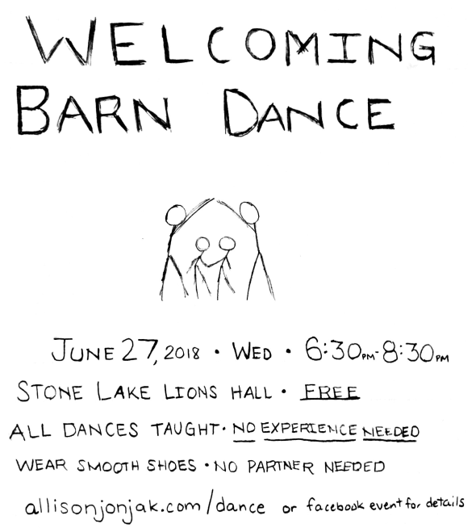

## Welcoming Barn Dance

Come dance with friends and neighbors! A mix of fun, simple, American folk dances* will be taught and called. I'm looking forward to sharing a skill I've been practicing with you all.

who:  everyone is welcome. No partner needed, no experience needed.

when: 6:30 to 8:30pm, Wednesday June 27 (add to your  )

where: Stone Lake Lions Hall

wear: smooth-soled shoes, comfortable clothes. Twirly skirts are fun but not required.

music: We'll know for sure Tuesday, but we likely have the [Second Wind String Band][] providing our tunes, live! If not, recorded music featuring [Three Crooked Men][], the [Ripples][], and [Stringdancer][].

cost: free. We'll have a tip jar out for the Lions.

why: it'll be fun!

*chestnuts, Sicilian circles, square dances, mixers, and simple contras---all using the same moves

[Three Crooked Men]: http://www.threecrookedmen.com
[Second Wind String Band]: http://stringband.webs.com
[Ripples]: http://theripplesband.com
[Stringdancer]: http://www.westendweb.com/stringdancer/

